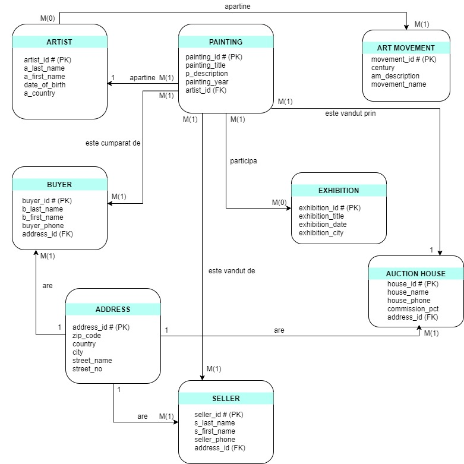
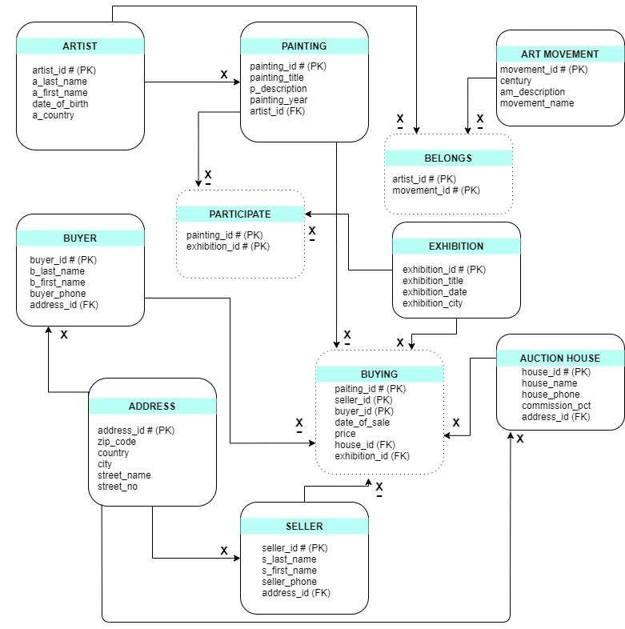

# Art Gallery Database
A database designed in **SQL** using **Oracle SQL Developer** for The Faculty of Mathematics and Informatics, University of Bucharest.

## What will you find here?
This DB was designed for an auction house to help the buying process more easy. The are informations about paintings, buyers, sellers, purchases, artists, art movements
and exhibitions.

## Features:
- 🟣 an artist could have worked in more artistic currents
- 🟣 several paintings are exhibited at an exhibition and a painting can be exhibited at several exhibitions
- 🟣 an acquisition is determined by the painting that is sold, by the buyer and by the seller, and a painting is sold within an exhibition, through an auction house
- 🟣 organizers can add, modify, and delete tasks and assign tasks to team members
- 🟣 for private acquisitions, the id of the exhibition and the id of the auction house would not always be necessary
- 🟣 we know the address of the auction houses, the buyer, the seller

## The Entity-Relationship Diagram

## The Conceptual Diagram

